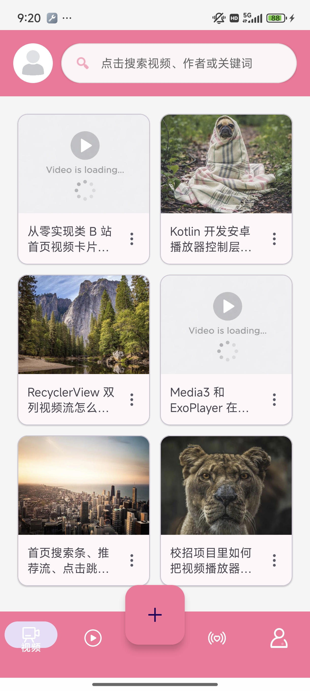

# BRedio

一个基于 Kotlin 开发的 Android 视频应用练习项目，目标是逐步实现类似 B 站的首页推荐流、搜索页、短视频页、配置化底部导航以及可扩展的播放器模块。

项目地址：<https://github.com/woshilaixuex/Bvideo>

## 项目预览

### 首页效果



## 当前实现

- 启动页与用户协议弹窗
- 首页顶部搜索条，点击跳转搜索页
- 首页双列视频推荐流，使用 mock 数据渲染
- 基于 `RecyclerView + GridLayoutManager(2)` 的双列卡片布局
- 基于 `Glide` 的封面图加载，磁盘缓存策略使用原始数据缓存 `DiskCacheStrategy.DATA`
- 首页视频卡片点击跳转视频播放页
- 视频播放页复用首页封面作为首帧兜底，播放器 `READY` 后淡出封面
- Activity 级全局播放器 `GlobalPlayerViewModel`，用于复用播放器实例
- 底部导航通过 `assets/nav_bottom_item.json` 配置
- 自定义 `@NavDestination` 注解，使用 KSP 生成导航注册表
- 独立 `player` 模块，包含播放控制、缓存、预加载和状态通知

## 模块结构

```text
app      应用入口、页面导航、首页/搜索页/用户页/播放页等 UI
common   通用工具与基础封装
data     数据层预留
domain   领域模型与业务实体
player   播放器封装、缓存、预加载与可替换播放内核设计
nav-api  导航注解、导航数据结构与运行时 NavRegistry 入口
plugin   KSP 导航注册生成器；历史 ASM 插件链路暂时保留但不作为当前主链路
```

## 导航注册

当前导航注册链路使用 KSP，不再依赖 ASM 扫描后生成源码。

页面通过 `@NavDestination` 声明路由，例如：

```kotlin
@NavDestination(route = VideoFragment.ROUTE, type = NavType.FRAGMENT)
class VideoFragment : Fragment()
```

编译时 `plugin` 模块里的 KSP 处理器会扫描这些注解，生成 `NavRegistryEntries`。`nav-api` 模块中的 `NavRegistry` 作为稳定入口，供 app 侧 `NavGraphBuilder` 构建运行时 `NavGraph`。

底部导航配置位于：

```text
app/src/main/assets/nav_bottom_item.json
```

底部 tab 的 route 需要和 `@NavDestination(route = "...")` 保持一致，点击 tab 时通过 route 找到对应目的地并进行切换。

## Player 模块说明

`player` 模块是当前项目的重点基础设施，已经拆出独立播放器层，方便后续扩展倍速、全屏、手势控制、清晰度切换等能力。

当前包含：

- `VideoPlayerEngine`：播放器能力接口，约束播放、暂停、seek、倍速、音量等基础能力
- `BVideoPlayerController`：基于 `Media3 / ExoPlayer` 的最小控制器封装，负责设置数据源、准备播放、开始/暂停/释放
- `BPlayerView`：对 `Media3 PlayerView` 的轻量包装，统一播放器视图绑定
- `BPlayerDataSource`：视频源管理的基础抽象
- `BPlayerCore`：播放器交互与状态控制的后续扩展入口
- `BPlayerCacheStore`：基于 Media3 `SimpleCache` 的视频缓存和预加载入口

这套结构的目标不是只“播起来”，而是为后续替换内核或扩展复杂播放器交互预留空间。

### 视频缓存与预加载

播放器的数据源已经接入缓存层，播放时不会直接把 URL 交给 ExoPlayer，而是通过 `BPlayerCacheStore.createMediaSource(...)` 创建 `CacheDataSource`。

当前缓存策略：

- 缓存目录：`context.cacheDir/b_player_media_cache`
- 最大缓存：`256MB`
- 淘汰策略：`LeastRecentlyUsedCacheEvictor`，最近最少使用的数据优先清理
- 缓存粒度：URL 对应的 byte range，不是精确到帧或秒
- 命中缓存：从本地 `SimpleCache` 读取
- 未命中缓存：走网络 `DefaultHttpDataSource`，同时通过 `CacheDataSink` 写入缓存

预加载入口在 Activity 级 `GlobalPlayerViewModel`：

```kotlin
globalPlayerViewModel.preload(url)
```

默认预加载 5 秒，内部按估算码率换算成字节数，从视频起始位置预取一段数据。该策略适合 progressive MP4 的首帧和起播优化，但不是严格的“下载第 N 秒到第 M 秒”。如果后续接入 HLS/DASH，可以进一步基于分片做更精确的时间段预加载。

### 图片缓存

首页封面和播放页兜底封面使用 Glide 加载，并设置：

```kotlin
diskCacheStrategy(DiskCacheStrategy.DATA)
```

该策略缓存原始下载数据。同一个封面 URL 在首页加载后，进入播放页使用相同 URL 时可以复用原始磁盘缓存，避免因为不同 View 尺寸导致只命中特定尺寸的变换缓存。

## 技术栈

- Kotlin
- Jetpack Navigation
- RecyclerView
- ViewBinding
- Material Components
- Glide
- Media3 / ExoPlayer
- KSP
- KotlinPoet
- 多模块 Gradle 工程

## 本地运行

```bash
./gradlew assembleDebug
```

或在 Windows 下：

```powershell
.\gradlew assembleDebug
```

如果遇到 Kotlin 增量编译缓存或文件锁问题，可以临时关闭增量编译：

```powershell
.\gradlew :app:assembleDebug --project-prop kotlin.incremental=false --no-daemon
```

常用验证命令：

```powershell
.\gradlew :app:compileDebugKotlin --project-prop kotlin.incremental=false --no-daemon
.\gradlew :player:compileDebugKotlin --project-prop kotlin.incremental=false --no-daemon
```

## 开发规划

- 接入真实视频列表数据源
- 完善搜索页与搜索结果流
- 丰富播放器控制层：倍速、全屏、进度拖动、状态管理
- 补充短视频纵向滑动播放页
- 预加载请求改造成 Flow 管道，支持防抖、去重和 UI 进度通知
- 接入真实封面和视频接口后，完善 Glide 与播放器缓存策略
- 补充导航生成器和播放器缓存的测试覆盖

## 说明

当前仓库仍处于持续迭代阶段，部分页面和模块已完成基础骨架，后续会围绕播放器能力、首页体验、导航生成和业务流继续完善。
